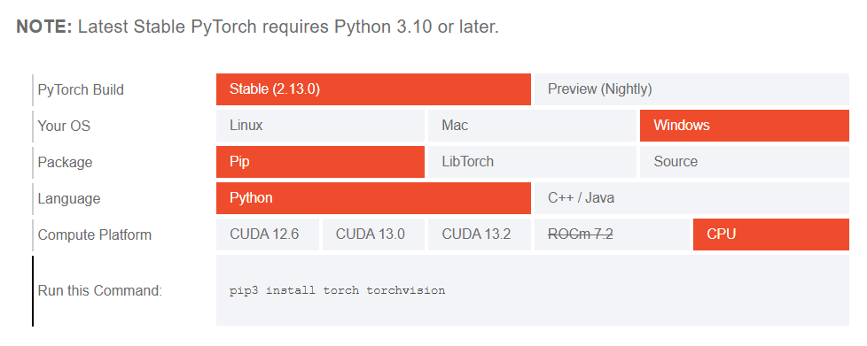
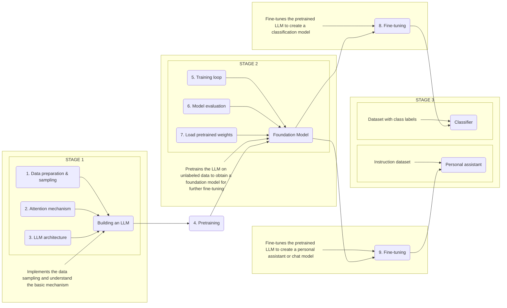

> This Book author is **Sebastian Raschka** from **Manning**. 

> I learned LLM from this book, His work on this book is nice and well structured. 

----

# Large-Language-Model

For my Learning from Book Author is "Sebastian Raschka (Ph.D)" - "Build A Large Language Model", The Device I used doc [1](report.md), [2](framework_for_device.md), [yml - Python Module](yml_generate.md), [c++ in *.ipynb](https://colab.research.google.com/github/hussain0048/C-Plus-Plus/blob/master/Basic_of_C%2B%2B.ipynb)

## System Specification

| **Category**                        | **Specification**                                                                                    |
| ----------------------------------- | ---------------------------------------------------------------------------------------------------- |
| **Operating System**                | Microsoft Windows 10 Home (64-bit)                                                                   |
| **OS Version**                      | 10.0.19045 (Build 19045)                                                                             |
| **System Manufacturer**             | Micro-Star International Co., Ltd. (MSI)                                                             |
| **System Model**                    | MS-7C09                                                                                              |
| **System Architecture**             | x64-based PC                                                                                         |
| **Processor (CPU)**                 | Intel® Core™ i3-9100F @ 3.60 GHz                                                                     |
| **CPU Cores / Threads**             | 4 Cores / 4 Threads                                                                                  |
| **BIOS Version**                    | American Megatrends Inc. Version 1.50                                                                |
| **Installed Physical Memory (RAM)** | 8 GB DDR4                                                                                            |
| **Available Physical Memory**       | Approximately 2.8 GB (at the time of measurement)                                                    |
| **Maximum Virtual Memory**          | 15.6 GB                                                                                              |
| **Execution Device for LLM**        | CPU (GPU acceleration not used)                                                                      |
| **Primary Compute Engine**          | Intel Core i3-9100F                                                                                  |
| **GPU**                             | NVIDIA GeForce GT 710 *(used for display; not suitable for modern PyTorch CUDA-based LLM inference)* |
| **Inference Platform**              | CPU-based PyTorch / LibTorch Inference                                                               |

> The three main stages of coding a large language are implementing 
1. The LLM architecture and data preparation process (stage 1)
2. pretraining an LLM to create a foundation model (stage 2),
3. fine-tuning the foundation model to become a personal assistant or text classifier (stage 3).

---

# Brief contents

1. Understanding large language models
2. Working with text data
3. Coding attention mechanisms
4. Implementing a GPT model from scratch to generate text
5. Pretraining on unlabeled data
6. Fine-tuning for classification
7. Fine-tuning to follow instructions
 
- A. Introduction to PyTorch
- B. References and further reading
- C. Exercise solutions
- D. Adding bells and whistles to the training loop
- E. Parameter-efficient fine-tuning with LoRA 

---

# Contents

- preface
- acknowledgments
- about this book
- about this author
- about the cover illustraction
1. Understanding large language models
   - 1.1 What is an LLM?
   - 1.2 Applications of LLMs
   - 1.3 Stages of building and using LLMs
   - 1.4 Introducing the transformer architecture
   - 1.5 Utilizing large datasets
   - 1.6 A closer look at the GPT architecture
   - 1.7 Building a large language model 
2. Working with text data
   - 2.1 Understanding word embeddings [⏳⚠️](https://vscode.dev/github/engineer-e/LLM-Python/blob/main/ch02/01_main-chapter-code/ch02.ipynb#C3)
   - 2.2 Tokenizing text [✔️](https://vscode.dev/github/engineer-e/LLM-Python/blob/main/ch02/01_main-chapter-code/ch02.ipynb#C4)
   - 2.3 Converting tokens into token IDs [✔️](https://vscode.dev/github/engineer-e/LLM-Python/blob/main/ch02/01_main-chapter-code/ch02.ipynb#C13)
   - 2.4 Adding special context tokens [✔️](https://vscode.dev/github/engineer-e/LLM-Python/blob/main/ch02/01_main-chapter-code/ch02.ipynb#C21)
   - 2.5 Byte pair encoding [✔️](https://vscode.dev/github/engineer-e/LLM-Python/blob/main/ch02/01_main-chapter-code/ch02.ipynb#C30)
   - 2.6 Data sampling with a sliding window [✔️](https://vscode.dev/github/engineer-e/LLM-Python/blob/main/ch02/01_main-chapter-code/ch02.ipynb#C35)
   - 2.7 Creating token embeddings [✔️](https://vscode.dev/github/engineer-e/LLM-Python/blob/main/ch02/01_main-chapter-code/ch02.ipynb#C48)
   - 2.8 Encoding word positions [✔️](https://vscode.dev/github/engineer-e/LLM-Python/blob/main/ch02/01_main-chapter-code/ch02.ipynb#C54)
3. Coding attention mechanisms
   - 3.1 The problem with modeling long sequences [⏳⚠️]()
   - 3.2 Capturing data dependencies with attention mechanisms [⏳⚠️]()
   - 3.3 Attending to different parts of the input with self-attention [⏳⚠️]()
      - A simple self-attention mechanism without trainable weights [✔️]()
      - Computing attention weights for all input tokens [✔️]()
   - 3.4 Implementing self-attention with trainable weights [⏳⚠️]()   
      - Computing the attention weights step by step [✔️]()
      - Implementing a compact self-attention Python class [✔️]()
   - 3.5 Hiding future words with causal attention [⏳⚠️]()
      - Applying a causal attention mask [✔️]()
      - Masking additional attention weights with dropout [✔️]()
      - Implementing a compact causal attention class [✔️]()
   - 3.6 Extending single-head attention to multi-head attention [⏳⚠️]()
      - Stacking multiple single-head attention layers [✔️]()
      - Implementing multi-head attention with weight splits [✔️]()
4. Implementing a GPT model from scratch to generate text
   - 4.1 Coding an LLM architecture
   - 4.2 Normalizing activations with layer normalization
   - 4.3 Implementing a feed forward network with GELU activations
   - 4.4 Adding shortcut connections
   - 4.5 Connecting attention and linear layers in a transformer block
   - 4.6 Coding the GPT model
   - 4.7 Generating text
5. Pretraining on unlabeled data
   - 5.1 Evaluating generative text models
     - Using GPT to generate text
     - Calculating the text generation loss
     - Calculating the training and validation set losses
   - 5.2 Training an LLM
   - 5.3 Decoding strategies to control randomness
     - Temperature scaling
     - Top-K sampling
     - Modifying the text generation function
   - 5.4 Loading and saving model weights in PyTorch
   - 5.5 Loading pretrained weights from OpenAI
6. Fine-tuning for classification
   - 6.1 Different categories of fine-tuning
   - 6.2 Preparing the dataset
   - 6.3 Creating data loaders
   - 6.4 Initializing a model with pretrained weights
   - 6.5 Adding a classification head
   - 6.6 Calculating the classification loss and accuracy
   - 6.7 Fine-tuning the model on supervised data
   - 6.8 Using the LLM as a spam classifier
7. Fine-tuning to follow instructions
   - 7.1 Introduction to instruction fine-tuning
   - 7.2 Preparing a dataset for supervised instruction fine-tuning
   - 7.3 Organizing data into training batches
   - 7.4 Creating data loaders for an instruction dataset
   - 7.5 Loading a pretrained LLM
   - 7.6 Fine-tuning the LLM on instruction data
   - 7.7 Extracting and saving responses
   - 7.8 Evaluating the fine-tuned LLM
   - 7.9 Conclusions
     - What's next?
     - Staying up to date in a fast-moving field
     - Final words
     
- *appendix A* - Introduction to PyTorch [✔️](https://vscode.dev/github/engineer-e/LLM-Python/blob/main/appendix-A/01_main-chapter-code/.ipynb_checkpoints/code-part1-checkpoint.ipynb#C1)
- *appendix B* - References and further reading
- *appendix C* - Exercise solutions 
- *appendix D* - Adding bells and whistles to the training loop
- *appendix E* - Parameter-efficient fine-tuning with LoRA